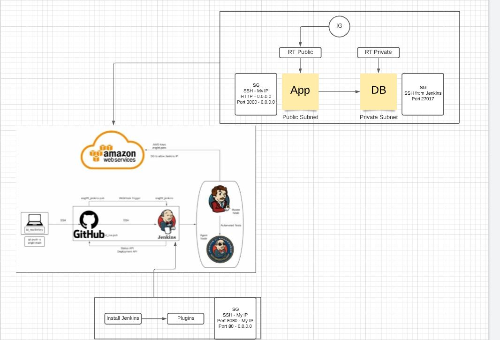

# Jenkins Task




Tasks:
- Research how to create a Jenkins server and create one on AWS EC2
- You will be sharing your Jenkins servers
- Research how to setup a Jenkins server
- Create a server instance per group on EC2. label it in the following format. name-name-name-Jenkins
- Setup Jenkins to run on your instance
- Create user accounts for each user on Jenkins and restrict access to logged in users only 
- build multi stage CICD pipeline with CI, Testing, CD and CDE
- deploy it in your own VPC - public and private subnets for app private for db
- Aim is to see all three pages working - home page - Fibonacci/4 - /posts


## Install Jenkins (AWS EC2)

1. Launch EC2 instance as normal 
2. Use your VPC created and public subnet
3. SG:
  - SSH - port 22 - My IP
  - Port 8080 - My IP
  - HTTP - Port 80 - 0.0.0.0/0
4. Launch instance using ssh in git bash
5. Installing Jenkins:
  - Install Java - https://www.digitalocean.com/community/tutorials/how-to-install-java-with-apt-on-ubuntu-18-04
```
`sudo apt update`
`sudo apt install default-jre`  --> Installs Java Runtime Environment (JRE)
`java -version`  --> version installed
`sudo apt install default-jdk`  --> Installs Java Development Kit (JDK)
`javac version`  --> jdk version

```
  - Install Jenkins - https://www.digitalocean.com/community/tutorials/how-to-install-jenkins-on-ubuntu-18-04
```
`wget -q -O - https://pkg.jenkins.io/debian-stable/jenkins.io.key | sudo apt-key add -`
`sudo sh -c 'echo deb http://pkg.jenkins.io/debian-stable binary/ > /etc/apt/sources.list.d/jenkins.list'`
`sudo apt update`
`sudo apt install jenkins`
`sudo systemctl start jenkins`
`sudo systemctl status jenkins`
`sudo ufw allow 8080`
`sudo ufw allow OpenSSH`
`sudo ufw enable`

```
6. Open in web browser - http://*IP from Jenkins EC2*:8080
7. `sudo cat /var/lib/jenkins/secrets/initialAdminPassword`  <-- from terminal it gives the password required to access
8. Install recommended plugins > Create account
9. Confirm Jenkins URL   


**need to allow port 22 to ssh into jenkins server - therefore need to provide jenkins ip**

## Job 1 - CI - Running initial app from GitHub repo
1. New Item > Description > Discard Old Builds > max 3 > Github URL (HTTP)
2. Git > github URL (SSH) > Add private key
3. Branch specifier > */main
4. Build Triggers > github hook trigger
5. Build Environment > Provide Node
6. Build > cd app, npm install, # npm start (to prevent running loop)
7. Post Build Actions > Build other projects > Job 2


## Job 2 - Merge from dev to main
1. New Item > Description > Discard Old Builds > max 3 > Github URL (HTTP)
2. Git > github URL (SSH) > Add private key
3. Branch specifier > */dev
4. Build Triggers > github hook trigger
5. Build Environment > Provide Node
6. Post build actions > Git publisher > Push only if build succeeds > Force push
7. Post build actions > Build other projects > Job 3


## Job 3 - Running app with db
1. New Item > Description > Discard Old Builds > max 3 > Github URL (HTTP)
2. Git > github URL (SSH) > Add private key
3. Branch specifier > */main
4. Build Triggers > github hook trigger
5. Build Environment > Provide Node
6. Build Environment > SSH Agent > Add > Copy existing key created from git bash
7. Build:

```
rsync -avz -e "ssh -o StrictHostKeyChecking=no" app ubuntu@34.247.83.93:/home/ubuntu
rsync -avz -e "ssh -o StrictHostKeyChecking=no" environment ubuntu@34.247.83.93:/home/ubuntu
rsync -avz -e "ssh -o StrictHostKeyChecking=no" environment ubuntu@10.0.1.203:/home/ubuntu


ssh -A -o StrictHostKeyChecking=no ubuntu@10.0.1.203  <<EOF

sudo chmod +x /home/ubuntu/environment/db/provision.sh
sudo /home/ubuntu/environment/db/provision.sh
exit
EOF


ssh -A -o StrictHostKeyChecking=no ubuntu@34.247.83.93  <<EOF


echo "export DB_HOST=mongodb://10.0.1.203:27017/posts" >> .bashrc
source ~/.bashrc

sudo chmod +x /home/ubuntu/environment/app/provision.sh
sudo /home/ubuntu/environment/app/provision.sh


sudo cp environment/app/default etc/nginx/sites-available/default

cd app

sudo apt install npm -y
sudo npm install pm2 -g

npm install
pm2 kill

node seeds/seed.js
pm2 start app.js

# npm start

EOF
```

