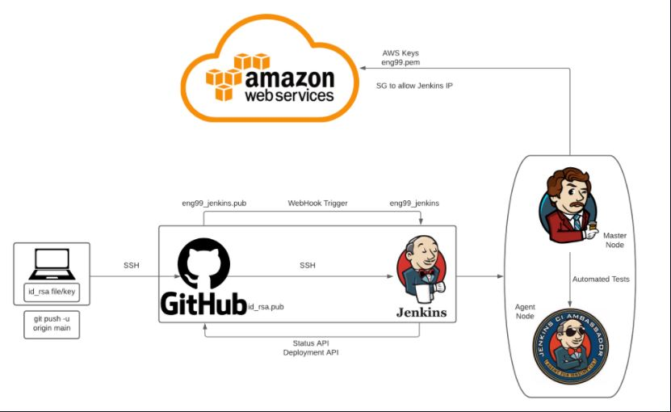
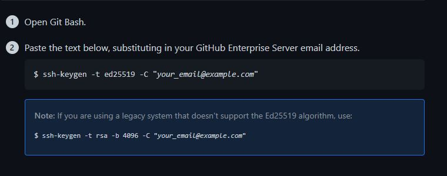
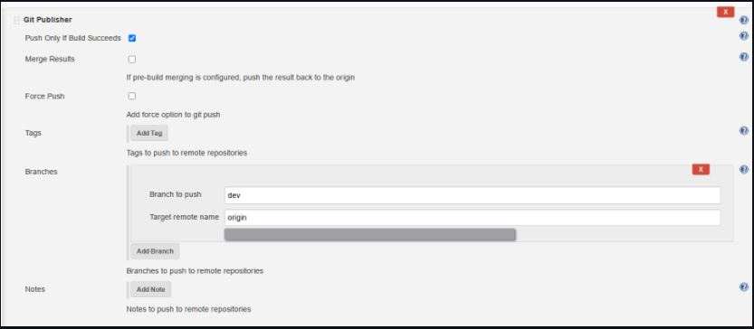

# CICD Pipeline with Jenkins



## SSH Keys GitHub - Jenkins

1. Open Git Bash
2. Paste in below command in SSH (cd ~/.ssh)

- This will generate id_rsa.pub (public key) and id_rsa (private key)
3. Copy public key into repo you want to connect securely with - settings > deploy keys > Add deploy keys
4. Check `allow write access`


## Webhook
- Webhooks allow external services to be notified when certain events happen 
- Git can automatically communicate with Jenkins to run tests when work is pushed to the github repo

1. On your repo --> `Settings` > `Webhooks` > `Add Webhook`
2. Add the URL of the Jenkins server in Payload URL --> e.g. http://35.177.3.56:8080/github-webhook/
3. Content type > `application/json`
4. Select > `send me everything`


## Task

Create another job called yourname_ci_merge in jenkins
1.	Create a new branch on localhost called dev
2.	Change main to dev in first job config
3.	Make any changes in your readme on localhost and push for github
4.	If tests passed it should trigger next job - yourname_ci_merge
5.	Merge job should simply merge code from dev to main 

6.	Next job CD/CDE – should get the code from main 
7.	Deliver to AWs EC2
8.	Cd app
9.	Npm install
10.	Npm start
11.	Deploy and run app


### Creating a Job in Jenkins - Job 1

1. `New Item` > Name > `Freestyle Project`
2. `Discard old builds` > Max: 3
3. `GitHub project` > Enter your project repo URL
4. `Office 365 Connector` > Restrict where project can be run > sparta_ubuntu_node
5. `Source Code Management` > Enter SSH URL from GitHub repo 
6. `Add Credentials` > Kind - SSH Username with private key > `Enter directly` > Paste private key from git bash (steps from above) > `Add` > Select key from dropdown
7. `Branches to build` > */dev  (or */main)
8. `Build Trigger` > GitHub hook
9. `Build Environment` > Provide Node & npm bin/folder to PATH 
10. `Build` > `Execute Shell` > cd app, npm install, npm start (comment out npm start for the time being otherwise test will continue to run)
11. Make changes to your repo and push to github and Jenkins will automatically run the test
12. Click on job > `Console Output` > Outcome of test given


### Merging from dev branch to main - Job 2

1. Build steps as before
2. Install GitHub plugin in Jenkins (if not installed)
3. Change the branch specifier to */dev and add post build action to run 2nd job.
4. Additional behaviours in source code management to merge before build: 
- name of repo - origin
- branch to merge - main
- merge strategy - default
- Fast-forward mode - --ff
5. Post build action to git push changes to appear on github.



### Deliver code to AWS EC2 and run app

- Job 1 and 2 have to be completed
1. Same steps as before 
2. In Build Environment select `SSH Agent` and select key `eng99.pem` (or create new if not already done)
3. Enter following code into `execute shell` and save/apply :

```
ssh -A -o "StrictHostKeyChecking=no" ubuntu@**enter EC2 instance IP** <<EOF     <-- no need to enter yes it will be done automatically

# Instead of git clone can also copy code using scp/rsync
git clone https://github.com/a-miah/eng99_cicd_Jenkins

# Permission to execute provision.sh
chmod +x eng99_cicd_Jenkins/environment/app/provision.sh

# Run provision.sh
eng99_cicd_Jenkins/environment/app/provision.sh

cd eng99_cicd_Jenkins/app

sudo apt install npm -y
sudo npm install -y
sudo npm start

EOF
```

4. Launch an EC2 instance on AWS
- Security Group for EC2: port 3000 - 0.0.0.0/0 > port 22 - 0.0.0.0/0
5. Enter the IP address from the EC2 instance into the above ssh code

test